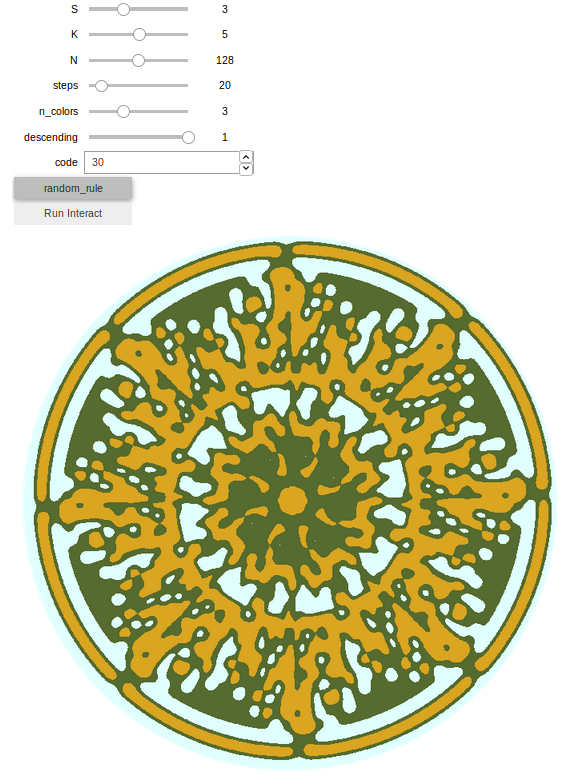

# Floral-Automata-Jupyter
A Jupyter Notebook with everything you need to draw floral automata, complete with an interactive tool to generate your own.

This repository is a companion to my Medium post ["*Creating Mandalas with Floral Automata*"](https://medium.com/@marcelodeoliveirarosaprates/creating-mandalas-with-floral-automata-f54219c9b837) which explains Floral Automata at length.

